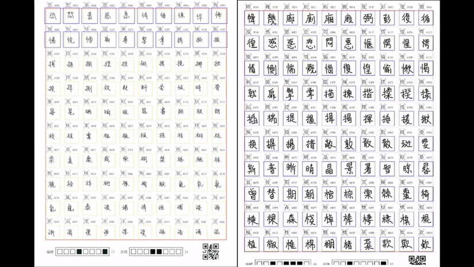

# Rotate_Crop_Page

For 字體課程 138 page 使用 (一部份參考同學程式)

本程式會自動進行質心置中，並縮放到同樣大小。

如果有任何問題請提出 Issue

！ 感謝 [Heng Wei Bin](https://github.com/HengWeiBin) 幫忙提高程式碼品質，並提升準確度以及效能 ！

### Demo 影片

<br>
<br>
# 初始化專案
**`環境建議使用 Python 3.9 (版本 3 以上應該都行...吧)`**

### 套件 Package

-   使用 requirements.txt 安裝

```cmd
pip install -r requirements.txt
```

-   或使用 pipenv 安裝 (本機需要有 pipenv 套件)

```cmd
# 建立虛擬環境
python -m pipenv shell

# Install requirements
pipenv install -r requirements.txt
```
- Anaconda 虛擬環境
```
conda create --name wordDesign python=3.9
conda activate wordDesign
pip install -r requirement.txt
```
<br>
<br>

# 使用說明
## **校正旋轉稿紙**
1. 資料準備，將掃描檔放在以學號命名文件夾底下
    ```
    <學號>/
    |-xxx.jpg
    ```
2. 執行程式 `s1_rotate_page.py`
   ```
    python s1_rotate_page.py --id <你的學號>
   ```
   - 程式就會讀取你學號路徑底下的全部JPG，並進行**旋轉調整**，最後保存到 `rotated_<你的學號>` 路徑底下
   - 學好當然也可以用其他字串取代

結束後，如果出現 `The following is the wrong file` 的話，照以下步驟手動修復：

1. 找出出錯檔案後，複製到 `rotated_<你的學號>` 資料夾並改名
2. 使用各種工具把圖片轉正（如果看不出有什麽問題也可以不修）
<br>
<br>

## **影像處理切割文字**
**`轉正後再做以下步驟：`**
1. 執行程式 `s2_crop_page.py`
   - 程式會將目標路徑設爲 `rotated_<你的學號>`，輸出路徑設爲 `<開始頁>_<結束頁>_<你的學號>`
   ```
    python s2_crop_page.py --id <你的學號>
   ```
   - 也可以在 `s2_crop_page.py` 的 `L391~L396` 修改參數，注意 **`SCALE`** 為重點要修改的參數
   ```
    - MULTIPROCESSING # 多進程，True不能顯示切割過程，無法中途停下
    - ADJUST_CENTROID # 文字重心對齊
    - SHOW # 顯示切割過程
    - SCALE # !!! 電子檔設5，紙本設20 !!!
    - COLOR_BOOST # 增加對比度，適用於紙本掃描較差的圖，但會嚴重影響效率
   ```
2. 輸入你要從哪個 Page 開始切割（不輸入 預設為 `1`）
3. 輸入切割到哪個 Page（不輸入 預設為 `138`）
4. 最後記得檢查是否有分割錯誤的字

結束後，如果出現一些問題的話，可以至已知問題中尋找解答！
<br>
<br>
## **對比字體相似度**
- 對比方法使用助教提供的 MSE、SSIM、LPIPS，當中 LPIPS 會牽扯到 PyTorch 機器學習模型，本程式會自動偵測執行環境是否適用 GPU 推理，否則將使用 CPU 推理
- 若想要使用 GPU 推理請自行到 Pytorch 官網查詢如何安裝環境
1. 準備文件
    - 將自己以及全部需要比對同學的`切割好的文字`放置於相同路徑，遵守檔名 `1_138_<學號>`
        ```
        root
        |-s3_compare.py
        |-1_138_<學號>
        |  |-1.png
        |  |-...
        |-1_138_<學號>
        |  |-1.png
        |  |-...
        ```
    - 缺少的字將會被跳過，比對以`自己學號文件夾内擁有的字爲準`，不一定要全部字存在
2. 執行 `s3_compare.py`
    - 對比你與另一位同學
        ```
        python s3_compare.py --myId <你的學號> --targetId <他的學號>
        ```
    - 對比你與很多同學
        ```
        python s3_compare.py --myId <你的學號> --targetId <他們的學號.txt>
        ```
    - 多人學號文件格式
        ```
        <學號> <名字（無用）>\n
        <學號> <名字（無用）>\n
        ```
    - 其他參數參考
        ```
        --myId <string> # 你的學號
        --targetId <string> # 目標學號
        --markDatabase <檔名.txt> # 計算分數保存檔名（不建議使用）
        --maxCompare <int> # 最高比對字數
        --skipExist # 跳過曾計算過的人
        --crossCompare <檔名.txt> # 將檔案内學號全部交叉比對，myId、targetId、markDatabase 參數將被忽略
        ```
<br>
<br>
<br>

# 已知問題以及解決步驟
通常`s1_rotate_page.py`不會有太大的問題，但`s2_crop_page.py`就不一樣了！ 
如果有更好的方法歡迎提出！

## 已知問題

1. The following is the wrong file & 字切割錯誤
    - 如果發現`s2_crop_page.py`輸出`The following is the wrong file`的話，可以先試試

       - 修改 `COLOR_BOOST` 參數、調色或去除雜訊以讓程式更好辨識
       - 或是手動切割

2. 發生 Exception
    - 大部分問題可能出在綠色 HSV 範圍上，因為掃描機掃出來的色彩並不是那麼 OK，所以範圍會每頁不同
       - 可以嘗試調整 `contrast(L179), lower/upper_green(L186)` 參數
3. 若有其他問題歡迎發 Issue 聯係作者詢問

## 解決方法
1. 找出字的頁面編號
    - 使用`find_word_page.py`來快速尋找出字的頁面編號：
        1. 執行`find_word_page.py`
        2. 輸入錯誤字的 Unicode，假設錯誤的字為`絕`，其 Unicode 為 `5584`(可以看檔名)，那這邊就輸入 `5584`
        3. 輸出 `Found 5584 in page 35`，就代表字在第 35 個 Page，接下來就可以針對頁面做修復或手動切割。
2. 手動切割
    - 若要讓字分割得更準確，可以使用 **`manual_cutting.py`** 來手動分割：
        1. 找出錯字的頁（可以用`find_word_page.py`）後，並單獨複製到其他地方
        2. 執行 `manual_cutting.py`
        3. 輸入頁面檔案路徑，例：`D:/50.png`
        4. 輸入頁面編號，例：`50`，這邊要正確，不然 Unicode 會是錯的！
        5. 接下來會開啟一個視窗，需要把整個字頁給框起來，可以參考底下的圖片！
            -  Console 會有說明
            -  按住右鍵會出現紅色輔助線，幫助對齊框線
            -  按住左鍵拖移會出現藍色選取框，把整個字都框起來
            -  確認藍色框 OK 後，按下任意鍵確認，程式就會開始切割
        6. 輸出資料夾名為`Result_<Page 編號>`
        7. 如果結果中還是有錯誤的話，再請手動修復，或是重新 RUN 整個流程

    - **`如果沒有對齊就會分割錯誤，請多加注意！`**

    


3. 去除污漬或強化色彩
    1. 可以使用`find_word_page.py`來找出出錯檔案
    2. 使用各種工具把圖片強化色彩，或去除污漬已讓程式更好辨識
